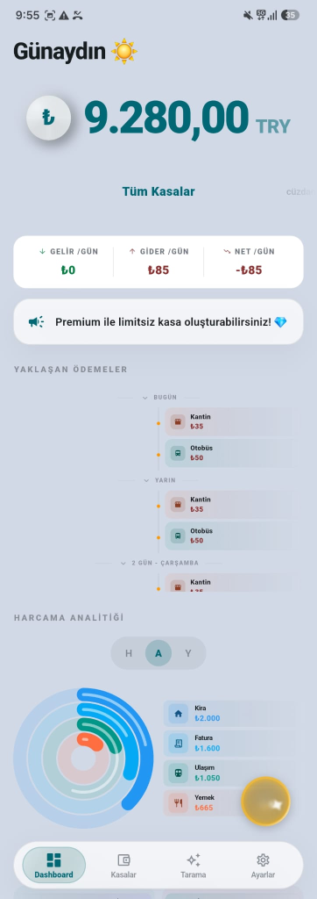
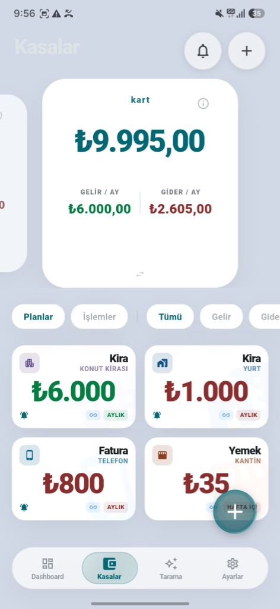
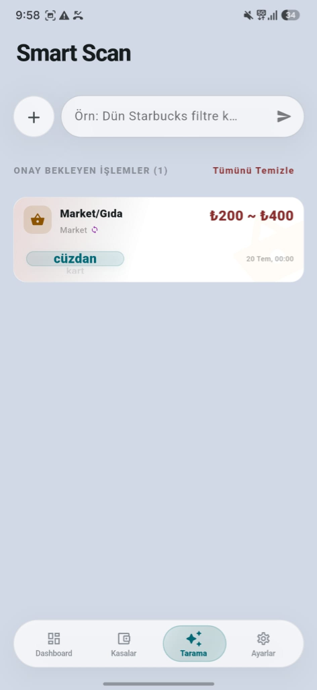
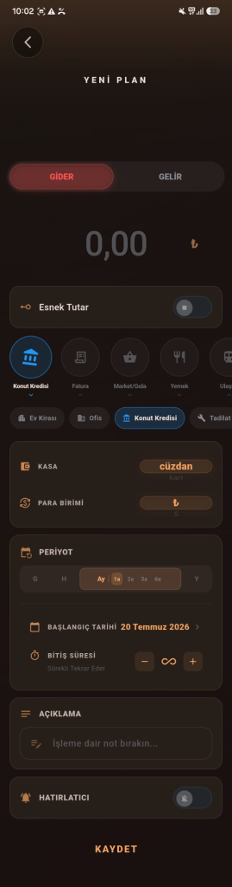
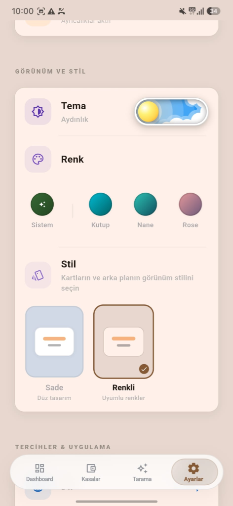

<div align="center">
  

  <br />
  <br />

  <h1>Finarcast 💸</h1>
  <p><strong>Flutter tabanlı, Yapay Zeka destekli yeni nesil finans ve abonelik yönetim uygulaması.</strong></p>

  <a href="#indir">
    
  </a>
  <a href="#indir">
    
  </a>

  <br />
  <br />

  
  
  
  
</div>

<br />

> **Not:** Finarcast, standart bütçe takibinin ötesine geçerek; varlıklarınızı özel **Kasalar (Vaults)** içinde yönetmenizi ve **Gemini AI** destekli **Smart Scan (Akıllı Tarama)** özelliğiyle doğal dil girdileriyle hızlıca işlem veya şablon taslakları oluşturmanızı sağlayan premium bir mobil uygulamadır.

---

## 📱 Ekran Görüntüleri

<p align="center">
  
  &nbsp;&nbsp;&nbsp;&nbsp;
  
  &nbsp;&nbsp;&nbsp;&nbsp;
  
</p>

<p align="center">
  
  &nbsp;&nbsp;&nbsp;&nbsp;
  
</p>

---

## ✨ Gerçek Özellikler (Uygulamada Olanlar)

<table>
  <tr>
    <td align="center" width="50%">
      <h3>🛡️ Kasa (Vault) ve Cüzdan Yönetimi</h3>
      <p>Nakit, banka kartı ve kredi kartı varlıklarınızı ayrı kasalara bölerek reaktif takip edin. <code>VaultGrid</code> ve <code>IntegratedVaultCard</code> ile gelir/gider akışını tek cüzdan altında izleyin.</p>
    </td>
    <td align="center" width="50%">
      <h3>🤖 AI Hızlı Giriş (Smart Scan)</h3>
      <p><code>google_generative_ai</code> (Gemini API) entegrasyonu sayesinde serbest metin veya fatura girdilerini analiz ederek saniyeler içinde taslak işlemler oluşturur. Analiz veya optimizasyon yapmaz; hızlı giriş odaklıdır.</p>
    </td>
  </tr>
  <tr>
    <td align="center" width="50%">
      <h3>🎨 Kişiselleştirilebilir Renkli Tasarım</h3>
      <p>Klasik cam efektleri yerine "Kutup", "Nane", "Rose" gibi renk paletleri ve "Sade/Renkli" kart stili seçenekleri sunar. <code>CustomCard</code>, <code>SolidSurface</code> ve Neumorphic yapılarla canlı bir arayüz sağlar.</p>
    </td>
    <td align="center" width="50%">
      <h3>🔁 Gelişmiş Tekrarlayan İşlemler</h3>
      <p>Günlük, haftalık, aylık veya yıllık periyotlu gelir/gider planları (RecurringTemplate) oluşturun. 'Esnek Tutar' özelliğiyle min-max aralığında bütçe senaryoları simüle edebilirsiniz.</p>
    </td>
  </tr>
</table>

---

## 🛠 Kullanılan Teknolojiler (Tech Stack)

Finarcast, en güncel Flutter paketleri ve modern mobil mimari standartlarıyla inşa edilmiştir:

*   **SDK & UI:**  (Material & Özel Bileşenler)
*   **State Management:** `flutter_riverpod` (Reaktif durum yönetimi)
*   **Veritabanı (Lokal & Uzak):** 
    *   `isar`: Işık hızında yerel veri depolama
    *   `supabase_flutter`: Uzak sunucu, senkronizasyon ve kimlik doğrulama
*   **Yapay Zeka:** `google_generative_ai` (Gemini API)
*   **Abonelikler (Premium):** `purchases_flutter` (RevenueCat entegrasyonu)
*   **Grafikler:** `fl_chart` (Veri görselleştirme)

---

## 🏗 Proje Klasör Yapısı

Proje özellikleri bağımsız modüller (Feature-based architecture) olarak ayrılmıştır:

```text
lib/
├── core/         # Temel yapılandırmalar (Tema, Veritabanı, Servisler)
├── features/     # İş modülleri
│   ├── auth/         # Giriş / Kayıt / Supabase Auth
│   ├── home/         # Dashboard, Özet Kartlar ve Ana Navigasyon
│   ├── smart_inbox/  # Doğal Dil ile Hızlı İşlem Girişi (Smart Scan)
│   ├── settings/     # Uygulama Tercihleri ve Profil
│   ├── subscription/ # Premium Abonelik Yönetimi (RevenueCat)
│   ├── transactions/ # İşlem Kayıtları, Şablonlar ve Periyotlar
│   └── vaults/       # Kasa/Cüzdan Yönetimi ve Transferler
├── l10n/         # Çoklu Dil Destekleri (ARB dosyaları)
└── shared/       # Ortak Bileşenler ve Yardımcı Araçlar (Widgets, Utils)
```

## 💾 Veritabanı ve Senkronizasyon Yapısı (Database & Sync)

Finarcast, **çevrimdışı öncelikli (offline-first)** veri mimarisi üzerine kurulmuştur. Veriler önce yerel veritabanında (**Isar**) saklanır ve internet bağlantısı sağlandığında arka planda bulut veritabanı (**Supabase**) ile çift yönlü olarak senkronize edilir.

### 1. Veritabanı Mimarisi

*   **Yerel Veritabanı (Isar DB):** Flutter için optimize edilmiş, NoSQL benzeri çalışan yüksek performanslı yerel nesne deposudur. Cihaz üzerinde hızlı veri okuma/yazma işlemleri ve reaktif akışlar (Stream) için kullanılır.
*   **Bulut Veritabanı (Supabase):** PostgreSQL tabanlı, kullanıcı verilerinin güvenli yedeklenmesi ve cihazlar arası eşitleme için kullanılır. **Row Level Security (RLS)** kuralları ile her kullanıcı sadece kendi verisine erişebilir.

### 2. Ayrıntılı Tablo Şemaları ve Veri Tipleri

Aşağıdaki tablolarda yerel Isar modelleri ile Supabase bulut tabloları arasındaki eşlemeler, veri tipleri ve açıklamaları yer almaktadır.

#### A. Kasalar/Hesaplar (`Vault` / `vaults`)
Kullanıcının nakit, banka, kredi kartı veya altın gibi varlıklarını yönettiği cüzdan/kasa yapılarıdır.
*Not: Kasa bakiyesi veritabanında saklanmaz; `BalanceService` aracılığıyla ilişkili somut işlem kayıtları toplanarak çalışma zamanında hesaplanır.*

| Isar Model Özelliği | Supabase Sütun Adı | Veri Tipi (Local / Remote) | Açıklama |
| :--- | :--- | :--- | :--- |
| `id` | `id` | `Id` (int) / `uuid` (PK) | Benzersiz kayıt kimliği |
| `name` | `name` | `String` / `text` | Kasa adı (örn: "Ana Cüzdan", "Yatırım") |
| `currency` | `currency` | `String` / `text` | Para birimi (TRY, USD, EUR veya AUTO) |
| `remoteId` | — | `String?` | Supabase'deki UUID eşleşmesi |
| `updatedAt` | `updated_at` | `DateTime` / `timestamptz` | Son güncelleme zamanı |
| `syncStatus` | — | `int` | Senkronizasyon durumu (0: Synced, 1: Pending, 2: Deleted) |

#### B. Tekrarlayan İşlem Şablonları (`RecurringTemplate` / `recurring_templates`)
Abonelikler, maaşlar veya kira gibi düzenli işlemlerin kural setidir. Somut işlem kayıtları (`TransactionRecord`) üretmek için kullanılır.

| Isar Model Özelliği | Supabase Sütun Adı | Veri Tipi (Local / Remote) | Açıklama |
| :--- | :--- | :--- | :--- |
| `id` | `id` | `Id` (int) / `uuid` (PK) | Benzersiz şablon kimliği |
| `title` | `title` | `String` / `text` | Şablon başlığı (örn: "Netflix", "Kira") |
| `categoryId` | `category_id` | `String?` / `text` | Dil bağımsız kategori kimliği |
| `iconCode` | `icon_code` | `String?` / `text` | Arayüzde kullanılacak kategori ikon kodu |
| `isIncome` | `is_income` | `bool` / `boolean` | Gelir (`true`) veya Gider (`false`) |
| `amount` | `amount` | `double` / `double precision` | İşlem tutarı |
| `minAmount` | `min_amount` | `double?` / `double precision` | Esnek bütçe için minimum tutar |
| `maxAmount` | `max_amount` | `double?` / `double precision` | Esnek bütçe için maksimum tutar |
| `periodType` | `period_type` | `int` / `integer` | Periyot kodlaması (Birim * 100 + Interval) |
| `recurrenceDay` | `recurrence_day` | `int?` / `integer` | Tekrarlama günü (örn: ayın 15'i veya haftanın 1. günü) |
| `recurrenceDate` | `recurrence_date` | `DateTime?` / `timestamptz` | Tekrarlamanın gerçekleşeceği hedef gün/ay bilgisini sabitleyen referans tarih (Örn: Her ayın 15'i veya her yılın 31 Aralık'ı) |
| `totalInstallments` | `total_installments` | `int?` / `integer` | Toplam taksit sayısı (Sonsuz ise `null`) |
| `startDate` | `start_date` | `DateTime` / `timestamptz` | Tekrarlamanın başlayacağı tarih |
| `vaultId` | `vault_id` | `int?` / `uuid` (FK) | İşlemin gerçekleşeceği kasa |
| `note` | `note` | `String?` / `text` | Şablona özel not |
| `currency` | `currency` | `String?` / `text` | Para birimi sembolü (örn: ₺, $, €) |
| `isArchived` | `is_archived` | `bool` / `boolean` | Şablonun arşivlenme durumu |
| `isNotificationEnabled` | `is_notification_enabled` | `bool` / `boolean` | Bildirim hatırlatıcısı aktif mi? |
| `hasNotification` | `has_notification` | `bool` / `boolean` | Bildirim gönderildi/gösterildi mi? |
| `notificationReminderDays` | `notification_reminder_days` | `int` / `integer` | Kaç gün kala bildirim gönderileceği |
| `notificationHour` | `notification_hour` | `int` / `integer` | Bildirim saati |
| `notificationMinute` | `notification_minute` | `int` / `integer` | Bildirim dakikası |
| `remoteId` | — | `String?` | Supabase'deki UUID eşleşmesi |
| `updatedAt` | `updated_at` | `DateTime` / `timestamptz` | Son güncelleme zamanı |
| `syncStatus` | — | `int` | Senkronizasyon durumu (0/1/2) |

#### C. İşlem Kayıtları (`TransactionRecord` / `transaction_records`)
Gerçekleşmiş veya planlanmış somut finansal hareketlerdir.

| Isar Model Özelliği | Supabase Sütun Adı | Veri Tipi (Local / Remote) | Açıklama |
| :--- | :--- | :--- | :--- |
| `id` | `id` | `Id` (int) / `uuid` (PK) | Benzersiz işlem kimliği |
| `title` | `title` | `String` / `text` | İşlem açıklaması / başlığı |
| `categoryId` | `category_id` | `String?` / `text` | Kategori kimliği |
| `iconCode` | `icon_code` | `String?` / `text` | Kategori ikon kodu |
| `isIncome` | `is_income` | `bool` / `boolean` | Gelir (`true`) veya Gider (`false`) |
| `amount` | `amount` | `double` / `double precision` | İşlem tutarı |
| `minAmount` | `min_amount` | `double?` / `double precision` | Minimum tutar (esnek bütçe için) |
| `maxAmount` | `max_amount` | `double?` / `double precision` | Maksimum tutar (esnek bütçe için) |
| `date` | `date` | `DateTime` / `timestamptz` | İşlemin yapıldığı veya planlandığı tarih/saat |
| `occurrenceDate` | `occurrence_date` | `DateTime` / `date` | Normalize gerçekleşme tarihi (sadece yyyy-MM-dd) |
| `vaultId` | `vault_id` | `int?` / `uuid` (FK) | İşlemin gerçekleştiği kasa |
| `targetVaultId` | `target_vault_id` | `int?` / `uuid` (FK) | Transfer işlemlerinde hedef kasa (varsa) |
| `templateId` | `template_id` | `int?` / `uuid` (FK) | Kaydı oluşturan şablonun kimliği (manuel ise `null`) |
| `occurrenceKey` | `occurrence_key` | `String` / `text` | Mükerrer kaydı önleyen benzersiz anahtar |
| `installmentNumber` | `installment_number` | `int?` / `integer` | Taksit numarası (örn: 3) |
| `totalInstallments` | `total_installments` | `int?` / `integer` | Toplam taksit sayısı (örn: 12) |
| `status` | `status` | `int` / `integer` | İşlem durumu (0: confirmed, 2: skipped) |
| `isReviewed` | `is_reviewed` | `bool` / `boolean` | Kullanıcı kaydı inceleyip onayladı mı? |
| `isArchived` | `is_archived` | `bool` / `boolean` | Arşivlenme durumu |
| `note` | `note` | `String?` / `text` | İşlem notu |
| `currency` | `currency` | `String?` / `text` | İşlemin para birimi |
| `snapshotRate` | `snapshot_rate` | `double?` / `double precision` | İşlem anındaki döviz kuru (Baz kur TRY'ye oran) |
| `remoteId` | — | `String?` | Supabase'deki UUID eşleşmesi |
| `updatedAt` | `updated_at` | `DateTime` / `timestamptz` | Son güncelleme zamanı |
| `syncStatus` | — | `int` | Senkronizasyon durumu (0/1/2) |

#### D. Uygulama Ayarları (`AppSettings` / `app_settings`)
Kullanıcı başına tek bir kayıt olarak saklanan genel tercihler ve stil ayarları.

| Isar Model Özelliği | Supabase Sütun Adı | Veri Tipi (Local / Remote) | Açıklama |
| :--- | :--- | :--- | :--- |
| `id` | — | `Id` (her zaman 1) | Tekil kayıt sabiti |
| `languageCode` | `language_code` | `String` / `text` | Uygulama dili (örn: "tr", "en") |
| `themeModeIndex` | `theme_mode_index` | `int` / `integer` | Tema seçimi (0: Sistem, 1: Aydınlık, 2: Karanlık) |
| `bgColorStyle` | `bg_color_style` | `int` / `integer` | Arayüz boyama stili (0: İkon, 1: Zemin, 2: Sade) |
| `accentColorValue` | `accent_color_value` | `int` / `bigint` | Temel vurgu rengi değeri (Hex int) |
| `currencySymbol` | `currency_symbol` | `String` / `text` | Varsayılan para birimi sembolü |
| `dataRetentionDays` | `data_retention_days` | `int` / `integer` | Otomatik arşivleme gün sınırı (-1 = kapalı) |
| `permanentDeletionDays` | `permanent_deletion_days` | `int` / `integer` | Kalıcı silme gün sınırı (-1 = kapalı) |
| `isNotificationsEnabled`| `is_ai_notifications_enabled` | `bool` / `boolean` | Yaklaşan işlem bildirimleri ana anahtarı |
| `isSyncEnabled` | `is_sync_enabled` | `bool` / `boolean` | Bulut eşitleme aktiflik durumu |
| `remoteId` | — | `String?` | Supabase'deki UUID eşleşmesi |
| `updatedAt` | `updated_at` | `DateTime` / `timestamptz` | Son güncelleme zamanı |
| `syncStatus` | — | `int` | Senkronizasyon durumu (0/1/2) |

#### E. Özel Kategoriler (`CustomCategory` / `custom_categories`)
Kullanıcılar tarafından eklenen özel harcama ve gelir kategorileri.

| Isar Model Özelliği | Supabase Sütun Adı | Veri Tipi (Local / Remote) | Açıklama |
| :--- | :--- | :--- | :--- |
| `id` | `id` | `Id` (int) / `uuid` (PK) | Benzersiz kayıt kimliği |
| `uniqueId` | `unique_id` | `String` / `text` | Dil bağımsız benzersiz kategori anahtarı |
| `parentId` | `parent_id` | `String` / `text` | Üst kategori kimliği |
| `name` | `name` | `String` / `text` | Kategori adı |
| `iconCode` | `icon_code` | `int` / `integer` | Kategori ikon kodu |
| `remoteId` | — | `String?` | Supabase'deki UUID eşleşmesi |
| `updatedAt` | `updated_at` | `DateTime` / `timestamptz` | Son güncelleme zamanı |
| `syncStatus` | — | `int` | Senkronizasyon durumu (0/1/2) |

#### F. Döviz Kurları (`ExchangeRate` - Sadece Yerel DB)
Uygulama içi para birimi dönüşümleri için kullanılan anlık kur verileri. Bu veriler sadece yerel cihazda önbelleğe alınır, bulut veritabanına eşitlenmez.

| Isar Model Özelliği | Veri Tipi | Açıklama |
| :--- | :--- | :--- |
| `id` | `Id` (int) | Benzersiz kayıt kimliği |
| `currencyCode` | `String` | Para birimi kodu (USD, EUR vb.) |
| `rate` | `double` | Baz birime (TRY) göre oranı (1 Döviz = X TRY) |
| `lastUpdated` | `DateTime` | Kurun son çekilme/güncellenme zamanı |

---

### 3. Periyot Kodlama Yapısı (`periodType`)

Sorgu performansı ve veritabanı tasarrufu için kullanılan formül: `(Birim * 100) + Sıklık (Interval)`

| Birim Değeri | Sıklık (X) | Örnek | Karşılığı |
| :--- | :--- | :--- | :--- |
| **`0`** | `0` | `0` | Tek Seferlik |
| **`100`** (Gün) | `X` | `101` | Her gün (Sıklık: 1 gün) |
| **`200`** (Hafta) | `X` | `201` | Haftalık (Sıklık: 1 hafta) |
| **`300`** (Ay) | `X` | `301` | Aylık (Sıklık: 1 ay) |
| **`400`** (Yıl) | `X` | `401` | Yıllık (Sıklık: 1 yıl) |
| **Özel** | — | `250` / `251` | Hafta İçi (250) / Hafta Sonu (251) |

---

### 4. Tekrarlayan İşlem Mimarisi (Hybrid Materialization)

Finarcast, tekrarlayan harcamaları ve abonelikleri takip etmek için **Hybrid Materialization (Hibrit Somutlaştırma)** mimarisini kullanır. Bu mimari, performansı optimize ederken geçmiş verilerin doğruluğunu korumayı hedefler.

*   **Geçmiş & Bugün (Somut Kayıt):** `occurrenceDate <= bugün` olan tüm periyot kayıtları veritabanında gerçek birer `TransactionRecord` olarak saklanır. Bu sayede geçmiş bakiye, grafik ve raporlar statik ve tutarlı kalır.
*   **Gelecek (Hesaplanmış Tahmin):** `occurrenceDate > bugün` olan gelecek işlemler veritabanında yer kaplamaz, `RecurrenceEngine` aracılığıyla çalışma zamanında dinamik olarak hesaplanır. Gelecek bütçe projeksiyonları ve takvim ekranı bu tahminleri kullanır.

#### A. RecurrenceEngine (Tekrarlama Motoru)
Herhangi bir veritabanı veya UI kütüphanesine bağımlı olmayan, saf Dart ile yazılmış periyot motorudur. `periodType` kurallarına göre gerçekleşme tarihlerini (`occurrenceDates`), sonraki gerçekleşmeyi (`nextOccurrence`) ve taksit numaralarını (`installmentNumber`) hesaplar.

#### B. MaterializationService (Somutlaştırma Servisi)
Veritabanındaki aktif `RecurringTemplate` kurallarını tarayarak `startDate` ile `bugün` arasındaki eksik periyotlar için somut `TransactionRecord` kayıtlarını oluşturur.
- **Mükerrer Kayıt Engelleme:** Her kayda `${templateRemoteId ?? templateId}_${yyyyMMdd}` formatında benzersiz bir `occurrenceKey` atanır.
- **Şablon Değişikliği:** Şablon düzenlendiğinde henüz kullanıcı tarafından görülmemiş/onaylanmamış (`isReviewed = false`) gelecek kayıtlar silinip yeni kurallara göre yeniden oluşturulur. İncelemesi tamamlanmış (`isReviewed = true`) olan geçmiş kayıtlara dokunulmaz.

#### C. BalanceService (Bakiye Servisi)
Uygulama genelindeki tek ve tutarlı bakiye hesaplama merkezidir.
- **Ledger Mantığı:** Bakiye hesaplanırken sadece `status != TransactionStatus.skipped` (atlanmamış) ve `date <= bugün` olan somut kayıtlar toplanır.
- **Senaryo Analizleri:** Esnek bütçeli işlemler için en iyi (gelirler maksimum, giderler minimum) ve en kötü (gelirler minimum, giderler maksimum) bakiye senaryolarını hesaplar.

---

### 5. Senkronizasyon ve Hata Yönetimi (Sync & Connection)

*   **Çevrimdışı Öncelikli Akış:** Kullanıcı interneti olmasa bile yerelde tüm işlemlerini yapar (`syncStatus = 1`). İnternet bağlantısı sağlandığında `SyncCoordinator` arka planda bu verileri Supabase ile eşitler ve durumlarını `syncStatus = 0` yapar. Silinen kayıtlar yerelde `syncStatus = 2` olarak işaretlenir ve buluttan silindikten sonra yerelden de kaldırılır.
*   **Çakışma Çözümü (Conflict Resolution):** Aynı kayıt üzerinde birden fazla cihazda değişiklik yapılmışsa, `updated_at` zaman damgasına göre **Last-Write-Wins (Son Yazan Kazanır)** kuralı işletilir.
*   **Supabase "Project Paused" (Proje Duraklatıldı) Tespiti:**
    Supabase ücretsiz planlarındaki projeleri belirli bir süre aktiflik olmadığında duraklatır (hibernate). Bu durumda uygulamadan yapılan istekler host çözümleme hatası verir.
    - `SyncCoordinator` ve `AuthErrorHelper` servisleri, internet bağlantısı hatalarında hata mesajının `supabase.co` içerip içermediğini ve bir host çözümleme hatası (`host lookup failed` / `failed host lookup`) olup olmadığını tespit eder.
    - Hata bu özel duruma uyuyorsa, genel bir "internet bağlantı hatası" yerine, kullanıcıya **"Bulut veritabanı projesi duraklatılmış (Project Paused). Lütfen Supabase panelinizden projeyi tekrar aktifleştirin."** uyarısını göstererek sorunun asıl kaynağını bildirir.

## 🚀 Geliştiriciler İçin Başlangıç

Projeyi lokal ortamınızda derlemek için aşağıdaki adımları izleyin.

### Kurulum

1. **Flutter SDK'yı yükleyin:** Cihazınızda Flutter `^3.9.2` ve üzeri kurulu olmalıdır.
2. **Repoyu indirin:**
   ```bash
   git clone <repository-url>
   cd Finarcast
   ```
3. **Bağımlılıkları yükleyin:**
   ```bash
   flutter pub get
   ```
4. **Kod Üretimini (Isar/Riverpod) Çalıştırın:**
   ```bash
   flutter pub run build_runner build --delete-conflicting-outputs
   ```
5. **Ortam Değişkenlerini Ayarlayın:** Proje dizininde bir `.env` dosyası oluşturun ve gerekli Supabase / Gemini API anahtarlarını ekleyin.
6. **Projeyi Başlatın:**
   ```bash
   flutter run
   ```
