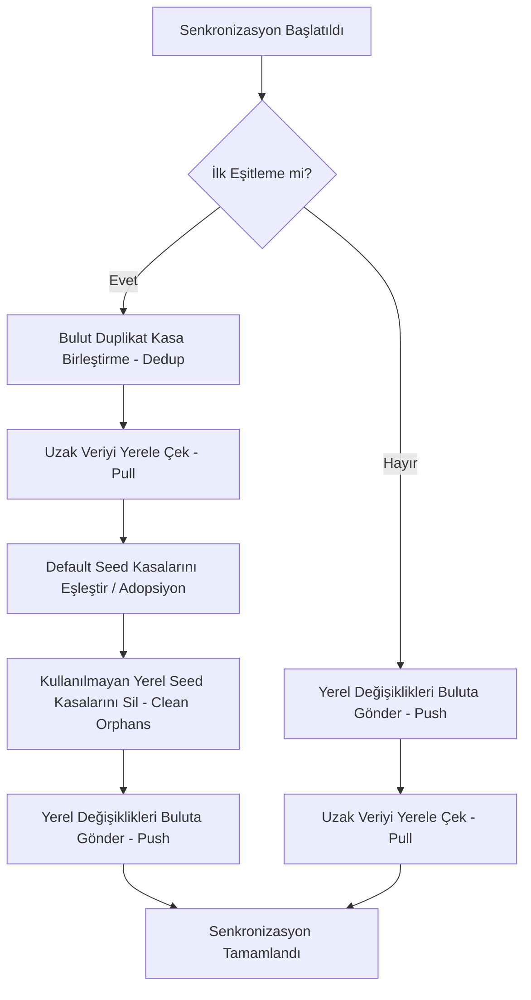

<div align="center">
  

  <br />
  <br />

  <h1>FinCast 💸</h1>
  <p><strong>Flutter tabanlı, Yapay Zeka destekli yeni nesil finans ve abonelik yönetim uygulaması.</strong></p>

  <a href="#indir">
    
  </a>
  <a href="#indir">
    
  </a>

  <br />
  <br />

  
  
  
  
</div>

<br />

> **Not:** FinCast, standart bütçe takibinin ötesine geçerek; harcamalarınızı özel **Kasalar (Vaults)** içinde izole etmenizi, **Gemini AI** destekli "Smart Inbox" (Akıllı Gelen Kutusu) üzerinden finansal optimizasyon yapmanızı sağlayan premium bir mobil uygulamadır.

---

## 📱 Ekran Görüntüleri

*Geliştirme aşaması tamamlandıkça, uygulamanın özel cam efektli (GlassSurface) ve neumorphic (InsetContainer) tasarımlarına sahip ekran görüntüleri buraya eklenecektir.*

<p align="center">
  
  &nbsp;&nbsp;&nbsp;&nbsp;
  
  &nbsp;&nbsp;&nbsp;&nbsp;
  
</p>

---

## ✨ Gerçek Özellikler (Uygulamada Olanlar)

<table>
  <tr>
    <td align="center" width="50%">
      <h3>🛡️ Kasa (Vault) Mimarisi</h3>
      <p>Nakit, Kredi Kartı gibi varlıklarınızı ayrı kasalara bölün. <code>VaultGrid</code> ve <code>IntegratedVaultCard</code> bileşenleriyle tüm bakiyelerinizi tek panelden yönetin.</p>
    </td>
    <td align="center" width="50%">
      <h3>🤖 Gemini AI Optimizasyonu</h3>
      <p><code>google_generative_ai</code> entegrasyonu ile harcama geçmişiniz analiz edilir. "Smart Inbox" (Akıllı Kutu) üzerinden size özel bütçe optimizasyon tavsiyeleri sunulur.</p>
    </td>
  </tr>
  <tr>
    <td align="center" width="50%">
      <h3>💎 Premium Cam Tasarım</h3>
      <p>Özel <code>GlassSurface</code>, <code>SolidSurface</code> ve sıvı animasyonlara sahip <code>DynamicSegmentedControl</code> bileşenleri ile üst düzey, akıcı bir arayüz deneyimi.</p>
    </td>
    <td align="center" width="50%">
      <h3>🔁 Akıllı İşlem ve Abonelikler</h3>
      <p>Tekrarlayan gelir ve giderlerinizi takip edin, uygulama içi özel hatırlatıcılar ile yaklaşan ödemelerinizi asla kaçırmayın.</p>
    </td>
  </tr>
</table>

---

## 🛠 Kullanılan Teknolojiler (Tech Stack)

FinCast, en güncel Flutter paketleri ve modern mobil mimari standartlarıyla inşa edilmiştir:

*   **SDK & UI:**  (Material & Özel Bileşenler)
*   **State Management:** `flutter_riverpod` (Reaktif durum yönetimi)
*   **Veritabanı (Lokal & Uzak):** 
    *   `isar`: Işık hızında yerel veri depolama
    *   `supabase_flutter`: Uzak sunucu, senkronizasyon ve kimlik doğrulama
*   **Yapay Zeka:** `google_generative_ai` (Gemini API)
*   **Abonelikler (Premium):** `purchases_flutter` (RevenueCat entegrasyonu)
*   **Grafikler:** `fl_chart` (Veri görselleştirme)

---

## 🏗 Proje Klasör Yapısı

Proje özellikleri bağımsız modüller (Feature-based architecture) olarak ayrılmıştır:

```text
lib/
├── core/         # Temel yapılandırmalar (Tema, Rotalar, Ortam Değişkenleri)
├── features/     # İş modülleri
│   ├── auth/         # Giriş / Kayıt
│   ├── dashboard/    # Ana Panel ve Widget Yöneticisi
│   ├── optimization/ # AI Asistan, Smart Inbox
│   ├── profile/      # Ayarlar ve Abonelik (Premium Orb)
│   ├── transactions/ # İşlem Ekleme, Periyot ve Hatırlatıcılar
│   └── vaults/       # Kasa Yönetimi
├── l10n/         # Çoklu Dil Destekleri
└── shared/       # Ortak Bileşenler (Custom Widgets)
```

## 💾 Veritabanı ve Senkronizasyon Yapısı (Database & Sync)

FinCast, **çevrimdışı öncelikli (offline-first)** veri mimarisi üzerine kurulmuştur. Veriler önce yerel veritabanında saklanır ve internet bağlantısı sağlandığında arka planda bulut veritabanı ile çift yönlü olarak senkronize edilir.

### 1. Veritabanı Mimarisi

*   **Yerel Veritabanı (Isar DB):** Flutter için geliştirilmiş, oldukça hızlı, NoSQL benzeri çalışan yerel nesne deposudur. Cihaz üzerinde internet yokken bile mikrosaniyeler seviyesinde okuma ve yazma performansı sağlar.
*   **Bulut Veritabanı (Supabase):** PostgreSQL tabanlı veri yönetim platformudur. Kullanıcıların verilerini bulutta yedeklemesini ve çoklu cihaz arasında anlık veri transferi yapmasını sağlar. Güvenlik, PostgreSQL **Row Level Security (RLS)** kurallarıyla sağlanmıştır; her kullanıcı yalnızca kendi `user_id` değerine bağlı verilere erişebilir.

### 2. Ayrıntılı Tablo Şemaları ve Veri Tipleri

Canlı Supabase veritabanında yer alan ve yerel modeller ile birebir eşlenen tablo yapıları şu şekildedir:

#### A. Kasalar/Hesaplar (`public.vaults`)
Kullanıcının varlıklarını (Nakit, Kredi Kartı, Vadeli Hesap vb.) yönettiği cüzdan yapılarıdır.
*   `id` (UUID, Primary Key): Kasanın benzersiz bulut anahtarı.
*   `user_id` (UUID, Foreign Key): `auth.users` tablosuna bağlı kullanıcı kimliği.
*   `name` (Text): Kasanın kullanıcı tarafından belirlenen adı.
*   `currency` (Text, Varsayılan: `'AUTO'`): Kasanın para birimi (TRY, USD, EUR vb.).
*   `balance` (Double Precision): Kasanın başlangıç/mevcut bakiye miktarı.
*   `updated_at` (Timestamptz): Son güncelleme zamanı (Eşitleme kontrolü için).

#### B. İşlemler ve Gelir-Gider Kayıtları (`public.transaction_records`)
Kasalara bağlı veya bağımsız çalışan tüm finansal işlemlerin tutulduğu tablodur.
*   `id` (UUID, Primary Key): İşlemin benzersiz bulut anahtarı.
*   `user_id` (UUID, Foreign Key): İşlemin sahibi olan kullanıcının kimliği.
*   `title` (Text): İşlem başlığı (örn. "Market Alışverişi", "Maaş").
*   `is_income` (Boolean): Gelir (`true`) veya Gider (`false`) ayrımı.
*   `category_id` (Text): Kategori benzersiz kimliği (örn. `exp_grocery_food`).
*   `amount` (Double Precision): Net işlem tutarı.
*   `min_amount` / `max_amount` (Double Precision, Opsiyonel): Esnek/aralıklı bütçelendirme için bütçe aralıkları.
*   `date` (Timestamptz): İşlemin gerçekleştiği tarih.
*   `period_type` (Integer): İşlemin tekrarlama periyodunu belirleyen özel şifrelenmiş kod (Bkz. Periyot Kodlama Yapısı).
*   `is_archived` (Boolean): İşlemin arşivlenip arşivlenmediği (Arşivlenen işlemler aktif listelerde gösterilmez fakat geçmiş analizlerde kullanılır).
*   `vault_id` (UUID, Foreign Key): İşlemin bağlı olduğu kasanın ID'si (`vaults.id` referansı, silindiğinde `SET NULL` olur).
*   `note` (Text, Opsiyonel): İşleme ait kullanıcı notları veya detay açıklamaları.
*   `currency` (Text): İşlemin yapıldığı para birimi.
*   `remaining_installments` (Integer, Opsiyonel): Taksitli borçlar için kalan taksit sayısı.
*   `recurrence_day` (Integer, Opsiyonel): Periyodik işlemin haftanın hangi günü (1-7) veya ayın hangi günü (1-31) tekrarlanacağı.
*   `recurrence_date` (Timestamptz, Opsiyonel): Periyodik işlemin ilk başlangıç veya sonraki tetiklenme tarihi.
*   `recurrence_duration` (Integer, Opsiyonel): Toplam kaç kez tekrarlanacağı (`0` ise sınırsız).
*   `is_notification_enabled` (Boolean): İşlem için bildirim hatırlatıcısının açık olup olmadığı.
*   `has_notification` (Boolean): Aktif planlanmış bir bildiriminin bulunup bulunmadığı.
*   `notification_reminder_days` (Integer): İşlem tarihinden kaç gün önce hatırlatılacağı.
*   `notification_hour` / `notification_minute` (Integer): Hatırlatma bildirimi saati ve dakikası.
*   `updated_at` (Timestamptz): Son güncelleme zamanı.

#### C. Uygulama Ayarları (`public.app_settings`)
Kullanıcıya özel arayüz, dil ve veri saklama tercihlerinin saklandığı tek satırlık tablodur.
*   `user_id` (UUID, Primary Key): Kullanıcının benzersiz kimliği (Kullanıcı başına 1 ayar kaydı düşer).
*   `language_code` (Text, Varsayılan: `'tr'`): Uygulama arayüz dili.
*   `theme_mode_index` (Integer): Tema tercihi (0: Sistem, 1: Aydınlık, 2: Karanlık).
*   `data_retention_days` (Integer, Varsayılan: `90`): Süresi dolmuş işlemlerin otomatik olarak arşivlenmesi için gün sınırı (`-1` ise otomatik arşivleme kapalı).
*   `is_ai_notifications_enabled` (Boolean): AI destekli analiz bildirimlerinin açık olması.
*   `is_sync_enabled` (Boolean): Bulut senkronizasyonunun aktif olup olmadığı.
*   `bg_color_style` (Integer, Varsayılan: `2`): Arka plan renklendirme stili (Sade, ikon boyama, zemin boyama).
*   `accent_color_value` (BigInt): Uygulama vurgu (accent) renginin 32-bit ARGB değeri.
*   `currency_symbol` (Text, Varsayılan: `'₺'`): Uygulamanın varsayılan genel para birimi.
*   `permanent_deletion_days` (Integer, Varsayılan: `-1`): Taksiti bitmiş veya tek seferlik olan, süresi geçmiş işlemlerin veritabanından kalıcı olarak (fiziksel olarak) silineceği gün sınırı (`-1` ise kalıcı silme kapalı).
*   `updated_at` (Timestamptz): Son güncelleme zamanı.

#### D. Özel Alt Kategoriler (`public.custom_categories`)
Kullanıcıların kendi oluşturduğu ve yönettiği kişiselleştirilmiş işlem alt kategorileridir.
*   `id` (UUID, Primary Key): Kategorinin benzersiz bulut anahtarı.
*   `user_id` (UUID, Foreign Key): Kategorinin sahibi olan kullanıcının kimliği.
*   `unique_id` (Text): İstemci tarafında oluşturulan benzersiz alt kategori kimliği (örn. `exp_grocery_custom_1700000000`).
*   `parent_id` (Text): Bağlı olduğu üst ana kategori kimliği (örn. `exp_grocery`).
*   `name` (Text): Özel alt kategorinin kullanıcı tarafından girilen adı.
*   `icon_code` (Integer): Kategorinin görüntüleneceği ikonun Material kod noktası.
*   `updated_at` (Timestamptz): Son güncelleme zamanı.

---

### 3. Periyot Kodlama Yapısı (`periodType`)

Periyodik ve tekrarlayan işlemlerin sıklığı ve aralıkları veritabanında performans kazanımı ve sorgu kolaylığı sağlamak için özel bir formülle (`(Birim * 100) + Sıklık (Interval)`) tamsayı olarak şifrelenir:

| Birim Değeri (Birim * 100) | Sıklık Değeri (Interval) | Örnek `periodType` | Karşılığı |
| :--- | :--- | :--- | :--- |
| **`0`** | `0` | `0` | Tek Seferlik (Tekrarlama yok) |
| **`100`** (Gün) | `X` (Gün sıklığı) | `101` / `103` | Her gün / 3 günde bir |
| **`200`** (Hafta) | `X` (Hafta sıklığı) | `201` / `202` | Haftalık / 2 haftada bir |
| **`300`** (Ay) | `X` (Ay sıklığı) | `301` / `306` | Aylık / 6 ayda bir |
| **`400`** (Yıl) | `X` (Yıl sıklığı) | `401` / `402` | Yıllık / 2 yılda bir |
| **Özel Kodlar** | — | `250` | Sadece Hafta İçi (Pazartesi - Cuma) |
| **Özel Kodlar** | — | `251` | Sadece Hafta Sonu (Cumartesi - Pazar) |

---

### 4. Senkronizasyon Akışı ve Çakışma Yönetimi (`SyncService`)

Uygulamanın veri eşitleme altyapısı reaktif ve çift yönlü çalışan bir senkronizasyon döngüsüne dayanır.

#### A. Yerel Senkronizasyon Durumları (`syncStatus`)
Yerel Isar DB'deki her kaydın durumunu izlemek için kullanılan bayrak kodları:
*   **`0` (Synced):** Veri yerelde ve bulutta tamamen eşittir.
*   **`1` (Pending):** Veri yerelde oluşturuldu veya güncellendi, henüz buluta gönderilmedi.
*   **`2` (Tombstoned / Deleted):** Veri yerelde silinmiştir. Senkronizasyon döngüsü sırasında önce buluttan silinir, işlem başarılı olursa yerel veritabanından da fiziksel olarak tamamen silinir.

#### B. Çakışma Çözüm Stratejisi
Veri çakışmalarını yönetmek için **Last-Write-Wins (Son Yazan Kazanır)** stratejisi uygulanır. Yerel ve uzak kayıtlardaki `updated_at` (UTC milisaniye cinsinden zaman damgası) karşılaştırılır:
*   Buluttaki kaydın zaman damgası yerel kayıttan daha yeniyse, buluttaki veri yerele çekilir (`pull`).
*   Yereldeki kaydın zaman damgası buluttan daha yeniyse, yereldeki veri buluta gönderilir (`push`).

#### C. Gelişmiş Senkronizasyon Döngüsü (Sync Cycles)



1.  **Bulut Duplikat Kasa Birleştirme (`_deduplicateCloudVaults`):** İlk senkronizasyonda bulutta aynı isimde mükerrer kasalar varsa, en eski olan kasa saklanır, diğerlerinin işlemleri bu kasaya taşınır ve duplikat kasalar buluttan temizlenir.
2.  **Varsayılan Kasa Eşleştirme (Seed Adoption):** Giriş yapan kullanıcının yerel cihazındaki ilk kurulumdan kalan default kasası, buluttaki mevcut kasasıyla otomatik olarak eşleştirilir (Adopt). Böylece "Cüzdan" adında iki ayrı kasanın oluşması engellenir.
3.  **Yerim Tohum Temizliği (`_cleanOrphanedSeedVaults`):** Buluttan veriler indikten sonra, yerel cihazda bulut verisiyle eşleşmeyen yetim default kasalar temizlenir.

---

## 🚀 Geliştiriciler İçin Başlangıç

Projeyi lokal ortamınızda derlemek için aşağıdaki adımları izleyin.

### Kurulum

1. **Flutter SDK'yı yükleyin:** Cihazınızda Flutter `^3.9.2` ve üzeri kurulu olmalıdır.
2. **Repoyu indirin:**
   ```bash
   git clone <repository-url>
   cd FinCast
   ```
3. **Bağımlılıkları yükleyin:**
   ```bash
   flutter pub get
   ```
4. **Kod Üretimini (Isar/Riverpod) Çalıştırın:**
   ```bash
   flutter pub run build_runner build --delete-conflicting-outputs
   ```
5. **Ortam Değişkenlerini Ayarlayın:** Proje dizininde bir `.env` dosyası oluşturun ve gerekli Supabase / Gemini API anahtarlarını ekleyin.
6. **Projeyi Başlatın:**
   ```bash
   flutter run
   ```
