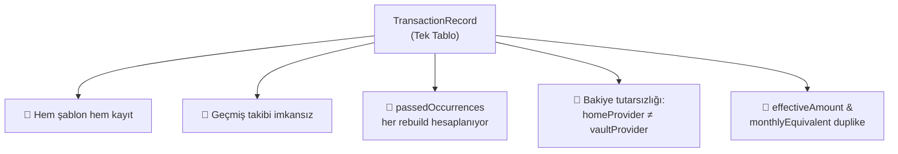
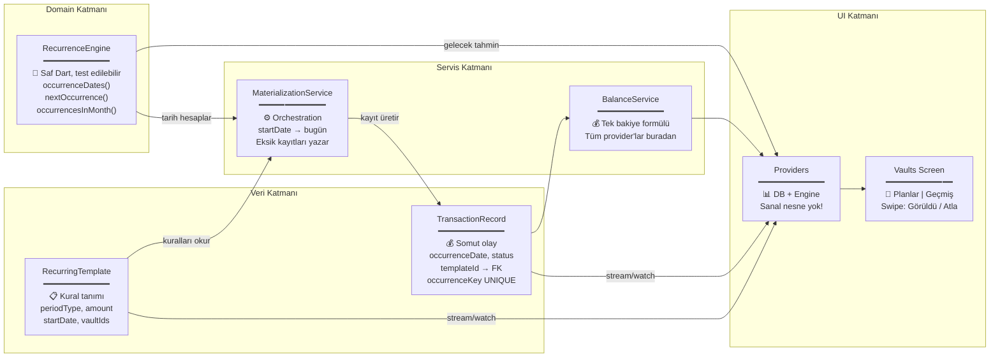
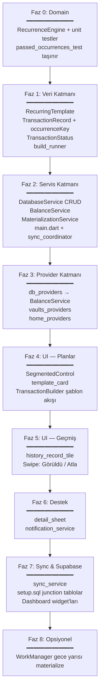

# Finarcast — Tekrarlı İşlem Mimarisi: Kökten Yeniden Tasarım

> [!IMPORTANT]
> Bu plan, mevcut `TransactionRecord` tabanlı "tek tablo" mimarisini tamamen kaldırıp, **production-grade bir iki tablo + domain + servis** mimarisine geçişi kapsar. Eski veri yoktur, temiz başlangıç yapılacaktır.

---

## Mevcut Sorunlar (Neden Değiştiriyoruz?)



| Sorun | Detay |
|---|---|
| **Tek tablo** | `TransactionRecord` hem kural (Netflix = aylık ₺99) hem somut olay (Haziran'da ₺99 ödendi). Şablon değişince geçmiş kaybolur. |
| **Sanal nesne üretimi** | `passedOccurrences` her provider rebuild'de O(N) hesaplanıyor. Günlük işlem × 6 ay = 180 tarih kontrolü. |
| **Bakiye tutarsızlığı** | `vaultCardDataProvider` → `amount × passedOccurrences`, ama `homeRealBalanceProvider` → sadece `amount`. İki farklı bakiye! |
| **Duplike mantık** | `effectiveAmount` ve `monthlyEquivalent` hem `TransactionRecord` hem `TransactionUI`'da birebir aynı kodla var. |

---

## Yeni Mimari: Hybrid Materialization (Geçmiş + Bugün Somut, Gelecek Hesaplanmış)

> [!TIP]
> Bu yaklaşım, üretim kalitesindeki finans uygulamalarının kullandığı standarttır. **Geçmiş ve bugünün** gerçekleşmeleri veritabanına yazılır; **gelecek** tahminler `RecurrenceEngine` ile hesaplanır (DB'ye yazılmaz). UI katmanı bakiye için sadece DB okur, tahmin için engine kullanır.

### Materialization Horizon (Ufuk Politikası)

| Zaman dilimi | Nerede yaşar | Kullanım |
|---|---|---|
| `occurrenceDate <= bugün` | `TransactionRecord` (Isar) | Bakiye, geçmiş, timeline, grafikler |
| `occurrenceDate > bugün` | Hesaplanır (`RecurrenceEngine`) | Due date radar, bildirimler, aylık planlama |

> Sonsuz aboneliklerde tüm geleceği DB'ye yazmak hem gereksiz hem riskli. Bu **hybrid** model en iyi dengeyi sağlar.



### Temel Fark: Sanal vs Hybrid Somut

| | Eski (Sanal) | Yeni (Hybrid) |
|---|---|---|
| **Geçmiş işlem** | Provider'da her rebuild hesaplanır | DB'de somut kayıt, `status=confirmed` |
| **Gelecek işlem** | Provider'da hesaplanır | `RecurrenceEngine` ile hesaplanır, DB'ye yazılmaz |
| **Bakiye hesabı** | `amount × passedOccurrences` (karmaşık, hatalı) | `BalanceService`: `Σ(record) where status≠skipped` |
| **Geçmiş** | Yok, şablon değişince kaybolur | Her ay/hafta ayrı kayıt, kalıcı |
| **Performans** | O(N×M) her rebuild | O(1) bakiye — sadece DB okuma |
| **Swipe atla** | Sanal nesneyi kayda çevirmek lazım | `status → skipped`, bitti |
| **Swipe görüldü** | — | `isReviewed → true` (bakiye değişmez) |

---

## Karara Bağlanan Tasarım Detayları

> [!IMPORTANT]
> **1. Status Politikası (Tek Boyut — `pending` KALDIRILDI):**
>
> | Alan | Değerler | Anlam |
> |---|---|---|
> | `status` | `confirmed` \| `skipped` | Mali etki: confirmed sayılır, skipped sayılmaz |
> | `isReviewed` | `true` \| `false` | UX/badge: kullanıcı kaydı gördü mü? |
>
> MaterializationService kayıt üretirken: `status = confirmed`, `isReviewed = false`.
> Bakiye **sadece** `status != skipped` kayıtları sayar — `isReviewed` bakiyeyi etkilemez.
> - Sağa swipe (Görüldü): `isReviewed = true` (status aynı kalır)
> - Sola swipe (Atla): `status = skipped`
> - Tutar düzenleme: kayıt güncellenir + `isReviewed = true` (kullanıcı müdahalesi = görüldü sayılır)

> [!NOTE]
> **2. Tekrar Limiti vs Taksit (`recurrenceDuration` KALDIRILDI):**
>
> Eski `recurrenceDuration` + `remainingInstallments` ikilisi kaldırılır. Yerine iki net kavram:
>
> | Kavram | Template alanı | Record alanı | Örnek |
> |---|---|---|---|
> | Sonsuz tekrar | `maxOccurrences = null`, `totalInstallments = null` | — | Netflix abonelik |
> | N kez tekrar | `maxOccurrences = N` | — | 6 ay kampanya |
> | Taksitli borç | `totalInstallments = N` | `installmentNumber`, `totalInstallments` | PS5 12 taksit |
>
> `maxOccurrences` ve `totalInstallments` **aynı anda dolu olamaz** — UI/form validasyonu bunu zorlar.
> Taksit modunda `maxOccurrences` yerine `totalInstallments` kullanılır; materialization taksit numaralarını otomatik atar (`1/12`, `2/12`).

> [!NOTE]
> **3. Idempotency (Çoklu Cihaz / Sync Güvenliği):**
>
> Her materyalize kayıt benzersiz anahtar taşır:
> ```dart
> @Index(composite: [CompositeIndex('templateId'), CompositeIndex('occurrenceDate')])
> // veya
> @Index(unique: true)
> String occurrenceKey = '';  // "${templateRemoteId ?? templateId}_${yyyyMMdd}"
> ```
> Materialization: `occurrenceKey` yoksa ekle, varsa atla. Sync pull sonrası duplicate oluşmaz.

> [!NOTE]
> **4. Şablon Düzenlendiğinde (Template Update Policy):**
>
> | Kayıt durumu | Şablon düzenlenince |
> |---|---|
> | `isReviewed = false` | Sil + yeniden materialize (Delete + Recreate) |
> | `isReviewed = true` | Korunur — geçmiş dokunulmaz |
> | Kullanıcı tutarı manuel değiştirdi | `isReviewed = true` olduğu için korunur |
>
> Sadece "Görüldü" işaretleyip tutara dokunmadıysa → şablon düzenlenince silinir ve yeniden oluşur.
> Bu beklenen davranıştır; kullanıcıya snackbar ile bildirilir: *"Onaylanmamış kayıtlar güncellendi."*

> [!NOTE]
> **5. Şablon Silindiğinde:**
> - `isReviewed = false` kayıtlar silinir
> - `isReviewed = true` kayıtlar geçmiş olarak kalır (`templateId` null yapılabilir veya korunur — raporlama için korunması tercih edilir)

> [!NOTE]
> **6. Gelecek Tahminler (Projection Policy):**
> Due date radar, bildirimler ve aylık planlama **DB kaydı beklemez**. `RecurrenceEngine.nextOccurrence(template, after: today)` kullanır.
> Mevcut DB kayıtları ile çakışma kontrolü: bir tarih için kayıt varsa projection listesinden çıkarılır.

---

## Önerilen Değişiklikler

### 0. Domain Katmanı (YENİ — RecurrenceEngine)

---

#### [NEW] [recurrence_engine.dart](file:///c:/Users/Yasir2.Prenses/Finarcast/lib/core/domain/recurrence_engine.dart)

Periyot hesaplamasının **tek kaynağı**. Saf Dart — Isar/Flutter bağımlılığı yok, unit test edilebilir.

```dart
/// Tekrar kuralı girdisi (RecurringTemplate'ten map edilir)
class RecurrenceRule {
  final int periodType;
  final DateTime startDate;
  final int? recurrenceDay;
  final DateTime? recurrenceDate;
  final int? maxOccurrences;      // null = sonsuz (taksit değilse)
  final int? totalInstallments;   // null = taksit değil
  // ...
}

abstract class RecurrenceEngine {
  /// startDate → until (dahil) arası tüm gerçekleşme tarihleri (normalize yyyy-MM-dd)
  static List<DateTime> occurrenceDates(RecurrenceRule rule, DateTime until);

  /// Verilen tarihten sonraki ilk gerçekleşme (bildirim / due date radar)
  static DateTime? nextOccurrence(RecurrenceRule rule, {required DateTime after});

  /// Belirli ay içindeki gerçekleşme sayısı (dashboard)
  static int occurrencesInMonth(RecurrenceRule rule, int year, int month);

  /// Taksit numarası hesapla (occurrence index → installmentNumber)
  static int? installmentNumber(RecurrenceRule rule, DateTime occurrenceDate);
}
```

> Mevcut `TransactionUI._countWeekdays`, `passedOccurrences`, `getOccurrencesInMonth` mantıkları **buraya taşınır**. `MaterializationService` ve `notification_service` bu engine'i çağırır — kendi hesaplamalarını yapmaz.

#### [NEW] [recurrence_engine_test.dart](file:///c:/Users/Yasir2.Prenses/Finarcast/test/recurrence_engine_test.dart)

`passed_occurrences_test.dart` kaldırılır, testler buraya taşınır:
- Günlük / haftalık / aylık / yıllık periyotlar
- Hafta içi (250) / hafta sonu (251)
- `maxOccurrences` limiti
- `totalInstallments` taksit numaralandırma
- Ay sonu edge case (31 Ocak → Şubat)

---

### 1. Veritabanı Modelleri (Veri Katmanı)

---

#### [NEW] [recurring_template.dart](file:///c:/Users/Yasir2.Prenses/Finarcast/lib/core/database/models/recurring_template.dart)

Sadece tekrarlama **kuralını** tanımlar. Bakiyeyi doğrudan etkilemez.

```dart
@collection
class RecurringTemplate {
  Id id = Isar.autoIncrement;

  // — Kimlik —
  String title = '';
  String? categoryId;
  String? iconCode;
  bool isIncome = false;

  // — Tutar —
  double amount = 0.0;
  double? minAmount;
  double? maxAmount;

  // — Periyot Kuralı —
  int periodType = 301;           // encoding: unit*100 + interval
  int? recurrenceDay;
  DateTime? recurrenceDate;
  int? maxOccurrences;            // N kez tekrar (null = sonsuz). totalInstallments ile karşılıklı dışlayıcı
  int? totalInstallments;         // Taksit sayısı (null = taksit değil). maxOccurrences ile karşılıklı dışlayıcı
  DateTime startDate = DateTime.now();

  // — İlişkiler —
  List<int> vaultIds = [];
  String? note;
  String? currency;

  // — Bildirim —
  bool isNotificationEnabled = false;
  bool hasNotification = false;
  int notificationReminderDays = 0;
  int notificationHour = 9;
  int notificationMinute = 0;

  // — Durum —
  bool isPaused = false;
  bool isArchived = false;

  // — Senkronizasyon —
  @Index()
  String? remoteId;
  @Index()
  DateTime updatedAt = DateTime.now();
  @Index()
  int syncStatus = 0;

  // — Hesaplama (@ignore) — sadece burada —
  @ignore
  RecurrenceRule get recurrenceRule => RecurrenceRule(...);

  @ignore
  double get effectiveAmount { /* mevcut mantık */ }

  @ignore
  double get monthlyEquivalent { /* mevcut mantık */ }

  @ignore
  double getConvertedMonthlyEquivalent(...) { /* mevcut mantık */ }
}
```

> `effectiveAmount`, `monthlyEquivalent` **sadece template'te** tanımlanır. `TransactionRecord`'da sadece `effectiveAmount` + `getConvertedAmount` kalır (somut tutar için).

---

#### [MODIFY] [transaction_record.dart](file:///c:/Users/Yasir2.Prenses/Finarcast/lib/core/database/models/transaction_record.dart)

Sadece **somut mali olayları** tutar.

**Kaldırılan alanlar:** `periodType`, `recurrenceDay`, `recurrenceDate`, `recurrenceDuration`, `remainingInstallments`, bildirim alanları (bildirimler template'te)

**Eklenen / güncellenen alanlar:**

```dart
@collection
class TransactionRecord {
  Id id = Isar.autoIncrement;

  // — Kimlik —
  String title = '';
  String? categoryId;
  String? iconCode;
  bool isIncome = false;

  // — Tutar —
  double amount = 0.0;
  double? minAmount;
  double? maxAmount;

  // — Zaman —
  DateTime date = DateTime.now();           // Gerçekleşme zamanı (saat dahil olabilir)
  @Index()
  DateTime occurrenceDate = DateTime.now(); // Normalize: yyyy-MM-dd 00:00 — materialization anahtarı

  // — İlişkiler —
  List<int> vaultIds = [];
  String? note;
  String? currency;

  // — Şablon Bağlantısı —
  @Index()
  int? templateId;                          // null = tek seferlik/manual

  // — Idempotency —
  @Index(unique: true, replace: true)
  String occurrenceKey = '';                // "${templateId}_${yyyyMMdd}" veya manual UUID

  // — Taksit —
  int? installmentNumber;
  int? totalInstallments;

  // — Durum (pending YOK) —
  @Index()
  int status = 0;                           // 0=confirmed, 2=skipped

  @Index()
  bool isReviewed = false;

  bool isArchived = false;

  // — Senkronizasyon —
  @Index()
  String? remoteId;
  @Index()
  DateTime updatedAt = DateTime.now();
  @Index()
  int syncStatus = 0;

  @ignore
  double get effectiveAmount { /* somut tutar mantığı */ }

  @ignore
  double getConvertedAmount(...) { /* mevcut mantık */ }

  /// Tek seferlik kayıt için occurrenceKey üretir
  static String generateManualKey() => 'manual_${Uuid().v4()}';
}
```

**TransactionStatus sabitleri:**

```dart
/// transaction_status.dart
abstract class TransactionStatus {
  static const int confirmed = 0;  // Mali etkili, varsayılan
  static const int skipped   = 2;  // Kullanıcı pas geçti, bakiyeden düşülür

  // NOT: pending (1) bilinçli olarak KALDIRILDI.
  // Görülmemiş kayıtlar: status=confirmed + isReviewed=false
}
```

---

### 2. Balance Service (YENİ — Tek Bakiye Kaynağı)

---

#### [NEW] [balance_service.dart](file:///c:/Users/Yasir2.Prenses/Finarcast/lib/core/services/balance_service.dart)

Tüm bakiye hesapları **tek yerden** yapılır. Provider'lar sadece wrapper.

```dart
class BalanceService {
  /// Ana formül: vault başlangıç + Σ(kayıt) where status≠skipped
  static double calculateNetBalance({
    required List<Vault> vaults,
    required List<TransactionRecord> records,
    required String targetCurrency,
    required List<ExchangeRate> rates,
  }) { ... }

  /// Kasa filtresi + tarih filtresi (home ekranı)
  static double calculateVaultBalance({
    required Vault vault,
    required List<TransactionRecord> records,
    required String targetCurrency,
    required List<ExchangeRate> rates,
    int? vaultId,
    DateTime? untilDate,
  }) { ... }

  /// Min/max senaryo (esnek bütçe)
  static double calculateMinBalance(...) { ... }
  static double calculateMaxBalance(...) { ... }
}
```

**Kullanan provider'lar (hepsi BalanceService'e delegasyon):**
- `netBalanceProvider` / `netMinBalanceProvider` / `netMaxBalanceProvider`
- `homeRealBalanceProvider` / `homeMinBalanceProvider` / `homeMaxBalanceProvider`
- `vaultCardDataProvider` (bakiye kısmı)

> [!TIP]
> Formül: `Σ(vault.balance) + Σ(record.amount where status≠skipped AND date≤today)`. Tek kaynak = tutarsızlık imkansız.

---

### 3. Materialization Service (Orchestration)

---

#### [NEW] [materialization_service.dart](file:///c:/Users/Yasir2.Prenses/Finarcast/lib/core/services/materialization_service.dart)

Hesaplama **RecurrenceEngine**'de; bu servis sadece orchestration yapar.

```dart
class MaterializationService {
  /// Ufuk: startDate → bugün (gelecek yazılmaz)
  static Future<void> materializeAll() async {
    final templates = await DatabaseService.getAllTemplates();
    final today = _normalizeDate(DateTime.now());

    for (final template in templates) {
      if (template.isPaused || template.isArchived) continue;
      await _materializeTemplate(template, until: today);
    }
  }

  static Future<void> _materializeTemplate(
    RecurringTemplate template, {required DateTime until},
  ) async {
    final existingKeys = await DatabaseService.getOccurrenceKeysForTemplate(template.id);

    // RecurrenceEngine — tek hesap kaynağı
    final dates = RecurrenceEngine.occurrenceDates(
      template.recurrenceRule,
      until,
    );

    final newRecords = <TransactionRecord>[];
    for (final date in dates) {
      final key = _buildOccurrenceKey(template, date);
      if (existingKeys.contains(key)) continue;

      newRecords.add(_createRecordFromTemplate(template, date, key));
    }

    if (newRecords.isNotEmpty) {
      await DatabaseService.addTransactionsBatch(newRecords);
    }
  }

  static TransactionRecord _createRecordFromTemplate(
    RecurringTemplate template, DateTime date, String occurrenceKey,
  ) {
    final installment = RecurrenceEngine.installmentNumber(
      template.recurrenceRule, date,
    );
    return TransactionRecord()
      ..title = template.title
      // ... diğer alanlar template'ten kopyalanır
      ..date = date
      ..occurrenceDate = _normalizeDate(date)
      ..occurrenceKey = occurrenceKey
      ..templateId = template.id
      ..installmentNumber = installment
      ..totalInstallments = template.totalInstallments
      ..status = TransactionStatus.confirmed
      ..isReviewed = false;
  }

  /// Şablon oluşturuldu / düzenlendi
  static Future<void> onTemplateChanged(RecurringTemplate template) async {
    // 1. isReviewed=false kayıtları sil
    await DatabaseService.deleteUnreviewedRecordsForTemplate(template.id);
    // 2. startDate → bugün yeniden materialize
    await _materializeTemplate(template, until: _normalizeDate(DateTime.now()));
  }

  static Future<void> onTemplateDeleted(int templateId) async {
    await DatabaseService.deleteUnreviewedRecordsForTemplate(templateId);
  }

  static String _buildOccurrenceKey(RecurringTemplate t, DateTime d) {
    final id = t.remoteId ?? t.id.toString();
    return '${id}_${_formatDate(d)}';
  }
}
```

**Ne zaman çalışır:**

| Tetikleyici | Eylem |
|---|---|
| **Uygulama açılışı** (`main.dart`) | `materializeAll()` |
| **Gece yarısı / WorkManager** (opsiyonel Faz 8) | `materializeAll()` — uygulama kapalıyken de bugünün kaydı oluşsun |
| **Yeni şablon oluşturuldu** | `onTemplateChanged(template)` |
| **Şablon düzenlendi** | unreviewed sil + yeniden materialize |
| **Şablon silindi** | `onTemplateDeleted()` — unreviewed silinir, reviewed kalır |
| **Sync pull sonrası** (`sync_coordinator.dart`) | Remote template geldiyse `onTemplateChanged()` |
| **Şablon duraklatıldı** | Yeni kayıt üretme durur, mevcut kayıtlar korunur |

---

### 4. Database Service Güncellemeleri

---

#### [MODIFY] [database_service.dart](file:///c:/Users/Yasir2.Prenses/Finarcast/lib/core/database/database_service.dart)

**Şema:**

```dart
_isar = await Isar.open([
  RecurringTemplateSchema,
  TransactionRecordSchema,
  VaultSchema,
  AppSettingsSchema,
  ExchangeRateSchema,
  CustomCategorySchema,
], directory: dir.path);
```

**Yeni CRUD:**

```dart
// RecurringTemplate
static Future<void> addTemplate(RecurringTemplate t) async { ... }
static Future<void> updateTemplate(RecurringTemplate t) async { ... }
static Future<void> deleteTemplate(int id) async { ... }
static Future<List<RecurringTemplate>> getAllTemplates() async { ... }
static Stream<List<RecurringTemplate>> watchAllTemplates() { ... }

// TransactionRecord
static Future<List<TransactionRecord>> getRecordsForTemplate(int templateId) async { ... }
static Future<Set<String>> getOccurrenceKeysForTemplate(int templateId) async { ... }
static Future<void> addTransactionsBatch(List<TransactionRecord> records) async { ... }
static Future<void> deleteUnreviewedRecordsForTemplate(int templateId) async { ... }
static Future<bool> occurrenceKeyExists(String key) async { ... }
```

**Kaldırılan:** `_migratePeriodTypes()`, `migrateSinglePeriodType()`, `getIncomeTransactions()`, `getExpenseTransactions()`

---

### 5. Provider Katmanı

---

#### [MODIFY] [db_providers.dart](file:///c:/Users/Yasir2.Prenses/Finarcast/lib/core/providers/db_providers.dart)

```dart
final templatesStreamProvider = StreamProvider<List<RecurringTemplate>>(
  (ref) => DatabaseService.watchAllTemplates(),
);
final allTemplatesProvider = Provider<List<RecurringTemplate>>((ref) {
  return ref.watch(templatesStreamProvider).valueOrNull ?? [];
});

// Bakiye — BalanceService delegasyonu
final netBalanceProvider = Provider<double>((ref) {
  return BalanceService.calculateNetBalance(
    vaults: ref.watch(allVaultsProvider),
    records: ref.watch(allTransactionsProvider),
    targetCurrency: ref.watch(settingsProvider).currencySymbol,
    rates: ref.watch(exchangeRatesProvider).value ?? [],
  );
});
```

#### [MODIFY] [vaults_providers.dart](file:///c:/Users/Yasir2.Prenses/Finarcast/lib/features/vaults/vaults_providers.dart)

1. **`TransactionUI` sadeleşir:** recurrence alanları + `passedOccurrences` + `getOccurrencesInMonth()` kaldırılır. Eklenir: `status`, `isReviewed`, `templateId`, `occurrenceDate`, `installmentNumber`
2. **`TemplateUI` eklenir** — şablon grid kartları
3. **`VaultViewMode`:** `templates` | `history`
4. **`vaultCardDataProvider`:** bakiye → `BalanceService`; aylık gelir/gider → template `monthlyEquivalent`

#### [MODIFY] [home_providers.dart](file:///c:/Users/Yasir2.Prenses/Finarcast/lib/features/home/home_providers.dart)

- Tüm bakiye provider'ları → `BalanceService`
- `dailyVelocityProvider` → template `monthlyEquivalent` / 30

---

### 6. UI Katmanı

---

#### [MODIFY] [vaults_screen.dart](file:///c:/Users/Yasir2.Prenses/Finarcast/lib/features/vaults/vaults_screen.dart)

- SegmentedControl: `[ 📋 Planlar | 📜 Geçmiş ]`
- Planlar: şablon grid
- Geçmiş: kronolojik liste (gün gruplu)

#### [NEW] [template_card.dart](file:///c:/Users/Yasir2.Prenses/Finarcast/lib/features/vaults/widgets/template_card.dart)

#### [NEW] [history_record_tile.dart](file:///c:/Users/Yasir2.Prenses/Finarcast/lib/features/vaults/widgets/history_record_tile.dart)

```
┌──────────────────────────────────────────────┐
│  ← ATLA (kırmızı)  │  GÖRÜLDÜ (yeşil) →      │
│ ┌──────────────────────────────────────────┐ │
│ │ 🎬 Netflix          ₺99.00    ⏳ Yeni     │ │
│ │ Eğlence · 1 Haz 2026                    │ │
│ └──────────────────────────────────────────┘ │
└──────────────────────────────────────────────┘
```

| Durum | Görünüm | Swipe |
|---|---|---|
| `confirmed` + `isReviewed=false` | Kesikli kenarlık + ⏳ "Yeni" badge | Sağ: Görüldü, Sol: Atla |
| `confirmed` + `isReviewed=true` | Normal + ✓ | Sol: Atla |
| `skipped` | Üzeri çizili, soluk | — |

#### [NEW] [history_day_group.dart](file:///c:/Users/Yasir2.Prenses/Finarcast/lib/features/vaults/widgets/history_day_group.dart)

#### [MODIFY] detail_sheet, vault_detail_sheet, transaction_builder_screen

- Tek seferlik → `TransactionRecord` (`templateId=null`, `occurrenceKey=generateManualKey()`)
- Tekrarlı → `RecurringTemplate` + `MaterializationService.onTemplateChanged()`
- Form validasyonu: `maxOccurrences` ⊥ `totalInstallments`

---

### 7. Diğer Servisler

---

#### [MODIFY] [notification_service.dart](file:///c:/Users/Yasir2.Prenses/Finarcast/lib/core/services/notification_service.dart)

- Bildirimler `RecurringTemplate` üzerinden
- `RecurrenceEngine.nextOccurrence()` kullanır — kendi hesaplaması yok

#### [MODIFY] [sync_service.dart](file:///c:/Users/Yasir2.Prenses/Finarcast/lib/core/services/sync_service.dart)

- `_pushPendingTemplates()` / `_pullTemplates()`
- Transaction push/pull: `templateId`, `status`, `isReviewed`, `occurrenceKey`, `occurrenceDate`, `installmentNumber`
- Pull sonrası: `MaterializationService.onTemplateChanged()` (duplicate önlemek için occurrenceKey)
- Kaldır: `periodType`, `recurrence_*` transaction alanları

#### [MODIFY] [sync_coordinator.dart](file:///c:/Users/Yasir2.Prenses/Finarcast/lib/core/services/sync_coordinator.dart)

- Sync tamamlandığında `MaterializationService.materializeAll()` tetikle

#### [MODIFY] notification_service, data_retention_service, draft_service — planla uyumlu güncelleme

---

### 8. Supabase Şema (Local ile Hizalı — Clean Slate)

---

#### [NEW] `recurring_templates`

```sql
CREATE TABLE public.recurring_templates (
  id UUID PRIMARY KEY DEFAULT gen_random_uuid(),
  user_id UUID NOT NULL REFERENCES auth.users(id) ON DELETE CASCADE,
  title TEXT,
  is_income BOOLEAN DEFAULT FALSE,
  category_id TEXT,
  icon_code TEXT,
  amount DOUBLE PRECISION DEFAULT 0,
  min_amount DOUBLE PRECISION,
  max_amount DOUBLE PRECISION,
  period_type INT DEFAULT 301,
  recurrence_day INT,
  recurrence_date TIMESTAMPTZ,
  max_occurrences INT,              -- recurrence_duration KALDIRILDI
  total_installments INT,
  start_date TIMESTAMPTZ DEFAULT NOW(),
  note TEXT,
  currency TEXT,
  is_paused BOOLEAN DEFAULT FALSE,
  is_archived BOOLEAN DEFAULT FALSE,
  is_notification_enabled BOOLEAN DEFAULT FALSE,
  has_notification BOOLEAN DEFAULT FALSE,
  notification_reminder_days INT DEFAULT 0,
  notification_hour INT DEFAULT 9,
  notification_minute INT DEFAULT 0,
  updated_at TIMESTAMPTZ DEFAULT NOW()
);

ALTER TABLE public.recurring_templates ENABLE ROW LEVEL SECURITY;
CREATE POLICY "Users manage own templates" ON public.recurring_templates
  FOR ALL USING (auth.uid() = user_id);
```

#### [NEW] Junction tablolar (çoklu kasa — local `List<int> vaultIds` ile uyumlu)

```sql
CREATE TABLE public.recurring_template_vaults (
  template_id UUID NOT NULL REFERENCES public.recurring_templates(id) ON DELETE CASCADE,
  vault_id UUID NOT NULL REFERENCES public.vaults(id) ON DELETE CASCADE,
  PRIMARY KEY (template_id, vault_id)
);

CREATE TABLE public.transaction_record_vaults (
  record_id UUID NOT NULL REFERENCES public.transaction_records(id) ON DELETE CASCADE,
  vault_id UUID NOT NULL REFERENCES public.vaults(id) ON DELETE CASCADE,
  PRIMARY KEY (record_id, vault_id)
);
```

#### [MODIFY] `transaction_records` (clean slate)

```sql
CREATE TABLE public.transaction_records (
  id UUID PRIMARY KEY DEFAULT gen_random_uuid(),
  user_id UUID NOT NULL REFERENCES auth.users(id) ON DELETE CASCADE,
  title TEXT,
  is_income BOOLEAN DEFAULT FALSE,
  category_id TEXT,
  icon_code TEXT,
  amount DOUBLE PRECISION DEFAULT 0,
  min_amount DOUBLE PRECISION,
  max_amount DOUBLE PRECISION,
  date TIMESTAMPTZ DEFAULT NOW(),
  occurrence_date DATE NOT NULL,
  template_id UUID REFERENCES public.recurring_templates(id) ON DELETE SET NULL,
  occurrence_key TEXT NOT NULL,
  installment_number INT,
  total_installments INT,
  status INT DEFAULT 0,
  is_reviewed BOOLEAN DEFAULT FALSE,
  is_archived BOOLEAN DEFAULT FALSE,
  note TEXT,
  currency TEXT,
  updated_at TIMESTAMPTZ DEFAULT NOW(),
  UNIQUE (user_id, occurrence_key)
);

ALTER TABLE public.transaction_records ENABLE ROW LEVEL SECURITY;
CREATE POLICY "Users manage own records" ON public.transaction_records
  FOR ALL USING (auth.uid() = user_id);
```

---

### 9. Dashboard Widget Güncellemeleri

---

#### [MODIFY] [due_date_radar_widget.dart](file:///c:/Users/Yasir2.Prenses/Finarcast/lib/features/home/widgets/due_date_radar_widget.dart)

- Yaklaşan ödemeler: `RecurrenceEngine.nextOccurrence()` — **DB kaydı beklemez**
- Mevcut DB kayıtlarıyla deduplicate
- `effectiveAmount` → template'ten

#### [MODIFY] spending_giants, timeline_activity — `status≠skipped` filtresi ekle

---

## Etki Analizi — Tüm Değişen Dosyalar

| Katman | Dosya | Değişiklik | Karmaşıklık |
|---|---|---|---|
| **Domain** | `recurrence_engine.dart` | 🆕 YENİ | Büyük |
| **Domain** | `recurrence_rule.dart` | 🆕 YENİ | Küçük |
| **Test** | `recurrence_engine_test.dart` | 🆕 YENİ | Orta |
| **Model** | `recurring_template.dart` | 🆕 YENİ | Orta |
| **Model** | `transaction_record.dart` | ♻️ REFACTOR | Büyük |
| **Model** | `transaction_status.dart` | 🆕 YENİ | Küçük |
| **Servis** | `balance_service.dart` | 🆕 YENİ | Orta |
| **Servis** | `materialization_service.dart` | 🆕 YENİ | Orta |
| **Servis** | `database_service.dart` | ♻️ REFACTOR | Büyük |
| **Servis** | `sync_service.dart` | ♻️ REFACTOR | Büyük |
| **Servis** | `sync_coordinator.dart` | ♻️ REFACTOR | Küçük |
| **Servis** | `notification_service.dart` | ♻️ REFACTOR | Orta |
| **Servis** | `data_retention_service.dart` | ♻️ REFACTOR | Küçük |
| **Servis** | `draft_service.dart` | ♻️ REFACTOR | Orta |
| **Provider** | `db_providers.dart` | ♻️ REFACTOR | Orta |
| **Provider** | `vaults_providers.dart` | ♻️ REFACTOR | Büyük |
| **Provider** | `home_providers.dart` | ♻️ REFACTOR | Orta |
| **UI** | vaults_screen, template_card, history_* | 🆕/♻️ | Büyük |
| **UI** | detail_sheet, vault_detail_sheet, transaction_builder | ♻️ REFACTOR | Orta-Büyük |
| **Home** | due_date_radar, spending_giants, timeline | ♻️ REFACTOR | Küçük |
| **Init** | main.dart, sync_bootstrap | ♻️ REFACTOR | Küçük |
| **DB** | Supabase setup.sql | ♻️ REFACTOR | Orta |
| **Test** | `passed_occurrences_test.dart` | 🗑️ KALDIR | — |

**Toplam:** ~35 dosya (10 yeni + 24 güncelleme + 1 kaldırma)

---

## Uygulama Sırası (Execution Order)



---

## Doğrulama Planı

### Otomatik Testler

```bash
dart run build_runner build --delete-conflicting-outputs

flutter test test/recurrence_engine_test.dart   # Ana domain testleri
flutter test test/widget_test.dart
# passed_occurrences_test.dart KALDIRILDI
```

**RecurrenceEngine test senaryoları:**
- Günlük/haftalık/aylık/yıllık periyotlar
- 250/251 hafta içi/sonu
- `maxOccurrences` limiti
- `totalInstallments` numaralandırma
- Ay sonu edge case
- `occurrenceKey` uniqueness (materialization idempotency)

### Manuel Doğrulama

1. **Materialization:** Açılışta startDate→bugün kayıtları oluşur; yarının kaydı oluşmaz
2. **Bakiye tutarlılığı:** Home = Vault = BalanceService (üç ekran aynı rakam)
3. **Swipe görüldü:** `isReviewed=true`, bakiye değişmez
4. **Swipe atla:** `status=skipped`, bakiye düzelir
5. **Şablon düzenleme:** unreviewed silinir+yenilenir; reviewed korunur; manuel tutar korunur
6. **Şablon silme:** reviewed kalır, unreviewed silinir
7. **Sync idempotency:** Aynı template iki cihazda pull → duplicate occurrenceKey yok
8. **Due date radar:** Gelecek tarih DB'de yokken doğru gösterilir (RecurrenceEngine)
9. **Çoklu kasa:** Junction tablo sync + local vaultIds uyumu
10. **Bildirimler:** Template + RecurrenceEngine.nextOccurrence()

---

## Gelecek İyileştirmeler (Bu Plana Dahil Değil)

| Konu | Not |
|---|---|
| **iCal RRULE** | `periodType` encoding yerine standart RRULE string — form refactor gerektirir |
| **Template versioning** | Şablon değişiklik geçmişi audit log — ihtiyaç olursa |
| **WorkManager** | Faz 8 opsiyonel — uygulama kapalıyken materialization |
